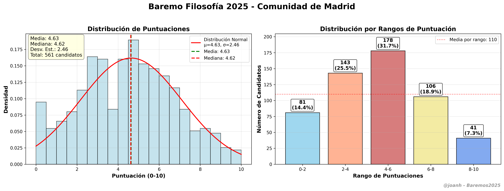
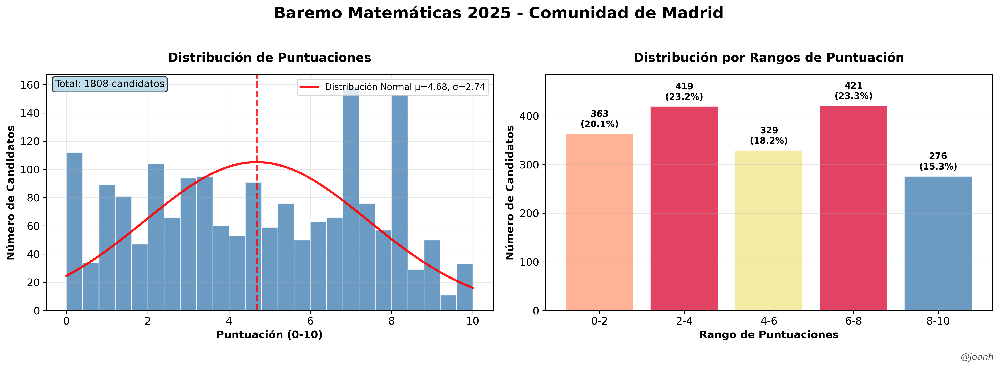
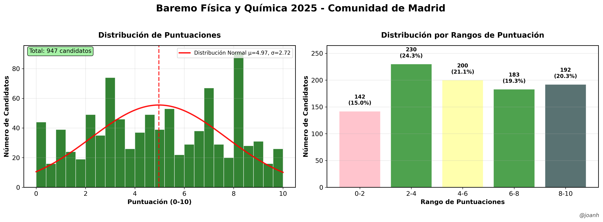
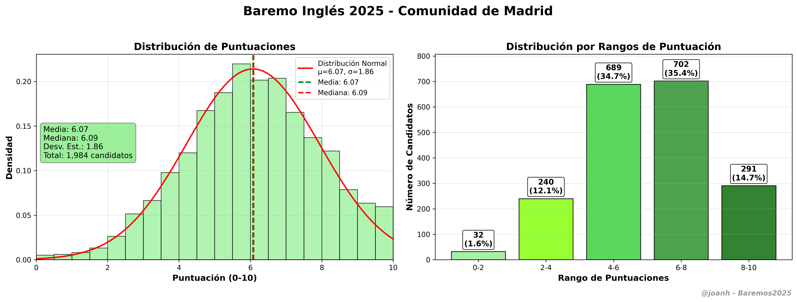
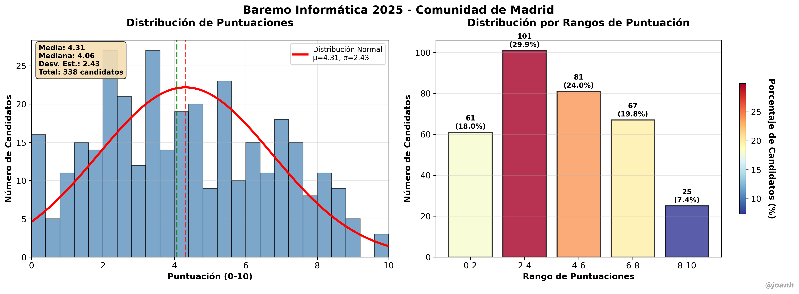

# Baremos2025 📊

Análisis completo de baremos de oposiciones de profesores de la Comunidad de Madrid para el año 2025.

[](https://www.python.org/)
[](LICENSE)
[](https://github.com/jmcarpenter2/pdfplumber)
[](https://numpy.org/)
[](https://matplotlib.org/)
[](https://scipy.org/)
[](https://pandas.pydata.org/)
[](https://claude.ai/)
[](https://github.com/joanh/Baremos2025)

## 📑 Índice de Especialidades (ordenadas por código)

| Código | Especialidad | Candidatos | Estado | Acceso Rápido |
|--------|--------------|------------|--------|---------------|
| **001** | [🧠 Filosofía](#-filosofía-001) | 561 | ✅ | [Estadísticas](especialidades/filosofia_001/output/estadisticas_filosofia_001_completas.txt) \| [Gráfico](img/baremo_filosofia_001_2025.png) |
| **004** | [📖 Lengua y Literatura](#-lengua-y-literatura-004) | 1,727 | ✅ | [Estadísticas](especialidades/lengua_literatura_004/output/) \| [Gráfico](img/baremo_lengua_literatura_004_2025.png) |
| **008** | [📐 Matemáticas](#-matemáticas-008) | 1,829 | ✅ | [Estadísticas](especialidades/matematicas_008/output/) \| [Gráfico](img/baremo_matematicas_008_2025.png) |
| **010** | [⚗️ Física y Química](#-física-y-química-010) | 962 | ✅ | [Estadísticas](especialidades/fisica_quimica_010/output/) \| [Gráfico](img/baremo_fisica_quimica_010_2025.png) |
| **011** | [🌍 Inglés](#-inglés-011) | 1,984 | ✅ | [Estadísticas](especialidades/ingles_011/output/estadisticas_ingles_011_completas.txt) \| [Gráfico](img/baremo_ingles_011_2025.png) |
| **107** | [💻 Informática](#-informática-107) | 343 | ✅ | [Estadísticas](especialidades/informatica_107/output/) \| [Gráfico](img/baremo_informatica_107_2025.png) |

**📊 Total candidatos analizados: 7,406**

---

## 🧠 Filosofía (001)

### Estadísticas Principales
- **Candidatos:** 561
- **Media:** 4.63 puntos
- **Desviación estándar:** 2.46
- **Mediana:** 4.62 puntos
- **Rango:** 0.00 - 10.00 puntos (corregido de 14.61)

### Gráfico de Distribución


**📁 Datos completos:** [Carpeta Filosofía](especialidades/filosofia_001/output/) | **📖 Documentación:** [README Filosofía](especialidades/filosofia_001/)

---

## 📖 Lengua y Literatura (004)

### Estadísticas Principales
- **Candidatos:** 1,727
- **Media:** 5.06 puntos
- **Desviación estándar:** 2.62
- **Mediana:** 5.00 puntos
- **Rango:** 0.00 - 13.00 puntos

### Gráfico de Distribución


**📁 Datos completos:** [Carpeta Lengua y Literatura](especialidades/lengua_literatura_004/output/) | **📖 Documentación:** [README Lengua y Literatura](especialidades/lengua_literatura_004/)

---

## 📐 Matemáticas (008)

### Estadísticas Principales
- **Candidatos:** 1,829
- **Media:** 5.07 puntos
- **Desviación estándar:** 2.61
- **Mediana:** 5.00 puntos
- **Rango:** 0.00 - 13.00 puntos

### Gráfico de Distribución


**📁 Datos completos:** [Carpeta Matemáticas](especialidades/matematicas_008/output/) | **📖 Documentación:** [README Matemáticas](especialidades/matematicas_008/)

---

## ⚗️ Física y Química (010)

### Estadísticas Principales
- **Candidatos:** 962
- **Media:** 5.09 puntos
- **Desviación estándar:** 2.62
- **Mediana:** 5.00 puntos
- **Rango:** 0.00 - 13.00 puntos

### Gráfico de Distribución


**📁 Datos completos:** [Carpeta Física y Química](especialidades/fisica_quimica_010/output/) | **📖 Documentación:** [README Física y Química](especialidades/fisica_quimica_010/)

---

## 🌍 Inglés (011)

### Estadísticas Principales
- **Candidatos:** 1,984
- **Media:** 6.07 puntos
- **Desviación estándar:** 1.86 puntos
- **Mediana:** 6.09 puntos
- **Rango:** 0.00 - 10.00 puntos (corregido)

### Gráfico de Distribución


**📁 Datos completos:** [Carpeta Inglés](especialidades/ingles_011/output/) | **📖 Documentación:** [README Inglés](especialidades/ingles_011/README_ingles.md)

---

## 💻 Informática (107)

### Estadísticas Principales
- **Candidatos:** 343
- **Media:** 6.84 puntos
- **Desviación estándar:** 2.44
- **Mediana:** 7.00 puntos
- **Rango:** 0.00 - 13.00 puntos

### Gráfico de Distribución


**📁 Datos completos:** [Carpeta Informática](especialidades/informatica_107/output/) | **📖 Documentación:** [README Informática](especialidades/informatica_107/)

---

## 🎯 Características

- **Análisis forense de PDFs** complejos con múltiples especialidades
- **Extracción automatizada** de puntuaciones manteniendo el orden original  
- **Visualización profesional** con gráficos estadísticos usando matplotlib y seaborn
- **Arquitectura modular** - Cada especialidad es totalmente independiente
- **Datos verificables** - Validación automática con puntuaciones de control
- **Múltiples formatos** - CSV, TXT, Python lists, gráficos PNG/PDF

## 📁 Estructura

```
Baremos2025/
├── especialidades/         # Análisis por especialidad
│   ├── filosofia_001/         # Filosofía (001)
│   ├── ingles_011/           # Inglés (011)
│   └── informatica_107/      # Informática (107)
├── src/                    # Código fuente
├── data/                   # PDFs originales
├── output/                 # Resultados generados
├── img/                    # Gráficos finales
├── config/                 # Configuración de especialidades
└── docs/                   # Documentación
```

## 🚀 Uso Rápido

1. **Analizar estructura del PDF:**
   ```powershell
   python src/analisis_forense_pdf.py
   ```

2. **Extraer datos de una especialidad:**
   ```powershell
   cd especialidades/filosofia_001
   python analisis_filosofia_rango_corregido.py
   ```

3. **Generar visualización:**
   ```powershell
   cd especialidades/ingles_011
   python analisis_ingles_corregido.py
   ```

## 🔧 Requisitos

```bash
pip install -r requirements.txt
```

**Dependencias principales:**
- Python 3.8+
- numpy (análisis numérico)
- matplotlib (visualización)
- scipy (estadísticas)
- pdfplumber (extracción de PDFs)

## 📊 Metodología

Este proyecto demuestra cómo realizar **minería de datos en PDFs complejos**:

1. **🔍 Análisis forense** para entender la estructura del PDF
2. **⚙️ Extracción precisa** manteniendo el orden original del documento
3. **📊 Visualización profesional** con estadísticas descriptivas
4. **✅ Validación de datos** con puntuaciones de control conocidas
5. **🎯 Corrección de rangos** limitando puntuaciones al máximo teórico (10.0)

## 🤝 Contribuir

1. Fork del repositorio
2. Crear rama para tu especialidad: `git checkout -b nueva-especialidad`
3. Añadir configuración en `config/especialidades.yaml`
4. Crear análisis siguiendo el patrón establecido
5. Pull request con documentación completa

## � Análisis del Repositorio

Para una evaluación técnica completa del proyecto, incluyendo análisis de código, utilidad práctica y valor educativo, consulta:

**📋 [Análisis Completo del Repositorio por Claude Sonnet 3.5](docs/analisis_repositorioByClaudeSonnet4.md)**

Este documento incluye:
- Evaluación técnica detallada (9.7/10)
- Análisis de impacto y utilidad real
- Métricas de éxito y escalabilidad
- Recomendaciones estratégicas para evolución futura

---

## �📝 Licencia

MIT License - Ver [LICENSE](LICENSE) para más detalles.

## ✍️ Autor

**@joanh** - Análisis y visualización de datos de oposiciones

---

⭐ **Si te resulta útil, ¡dale una estrella al repositorio!**

*Proyecto educativo para análisis de datos públicos de oposiciones docentes.*
