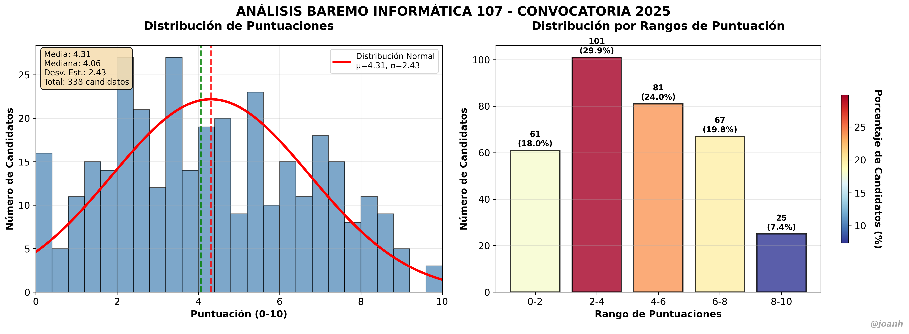

# Baremo2025 - Análisis de Oposiciones 📊

[](https://opensource.org/licenses/MIT)
[](https://www.python.org/)

[](https://github.com/jsvine/pdfplumber)
[](https://pandas.pydata.org/)
[](https://matplotlib.org/)
[](https://numpy.org/)

Herramientas para extraer y analizar datos de baremos de oposiciones desde PDFs oficiales.

## 🎯 Características

- **Análisis forense de PDFs** complejos con múltiples especialidades
- **Extracción automatizada** de puntuaciones manteniendo el orden original  
- **Visualización profesional** con gráficos estadísticos
- **Generalizable** para cualquier especialidad de oposiciones

## 📁 Estructura

```
Baremo2025/
├── src/                    # Código fuente
│   ├── analisis_forense_pdf.py    # Análisis de estructura PDF
│   ├── extractor_ORDEN_REAL.py    # Extractor en orden del PDF
│   └── baremo2025.py              # Visualización y estadísticas
├── data/                   # PDFs originales
├── output/                 # Resultados generados
├── config/                 # Configuración de especialidades
├── backup/                 # Archivos de desarrollo
├── docs/                   # Documentación
└── examples/              # Ejemplos de uso
```

## 🚀 Uso Rápido

1. **Analizar estructura del PDF:**
   ```bash
   python src/analisis_forense_pdf.py
   ```

2. **Extraer datos:**
   ```bash  
   python src/extractor_ORDEN_REAL.py
   ```

3. **Generar visualización:**
   ```bash
   python src/baremo2025.py
   ```

## 📊 Especialidades Disponibles

- **✅ Informática (107)** - Páginas 2649-2697 - 343 candidatos
- **🔧 Matemáticas** - Configurable
- **🔧 Física y Química** - Configurable  
- **🔧 Lengua y Literatura** - Configurable

## 🔧 Requisitos

```bash
pip install -r requirements.txt
```

## 📈 Ejemplo de Resultados



### Datos Extraídos

- **📊 343 candidatos** de Informática en orden del PDF
- **📈 Estadísticas completas** (media, mediana, percentiles)
- **📋 Múltiples formatos** (CSV, TXT, Python list)
- **🎨 Gráficos profesionales** con firma @joanh

## 🤝 Contribuir

1. Fork del repositorio
2. Crear rama para tu especialidad
3. Añadir configuración para nuevas especialidades
4. Pull request

## 📝 Licencia

MIT License

## ✍️ Autor

**@joanh** - Análisis y visualización de datos de oposiciones

### Metodología

Este proyecto demuestra cómo realizar **minería de datos en PDFs complejos**:

1. **🔍 Análisis forense** para entender la estructura
2. **⚙️ Extracción precisa** manteniendo el orden original
3. **📊 Visualización profesional** con estadísticas

---
⭐ Si te resulta útil, ¡dale una estrella al repo!
