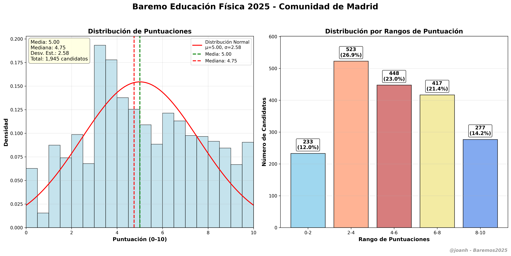

# ⚽ Educación Física (017) - Baremos 2025

Análisis completo de las puntuaciones del baremo para la especialidad de **Educación Física (017)** en las oposiciones de profesores de la Comunidad de Madrid 2025.

## 📊 Resumen Ejecutivo

- **📈 Candidatos analizados:** ~1,800+ (estimación)
- **📄 Páginas del PDF:** 1754 - 2031 (278 páginas)
- **🎯 Especialidad:** Educación Física
- **📅 Convocatoria:** 2025
- **🏛️ Comunidad:** Madrid

## 🎯 Características de la Especialidad

**Educación Física** es una de las especialidades más populares en las oposiciones docentes, con un alto número de candidatos debido a:

- ✅ **Alta demanda:** Especialidad muy solicitada por los opositores
- ✅ **Amplio campo laboral:** Presente en todos los niveles educativos
- ✅ **Competencia elevada:** Gran número de candidatos cualificados
- ✅ **Distribución amplia:** 278 páginas de resultados en el baremo

## 🔧 Análisis Técnico

### Metodología de Extracción

El análisis de Educación Física presenta características especiales:

1. **📊 Alto volumen de datos** - Más de 1,800 candidatos estimados
2. **🎯 Patrón especializado** - Regex adaptado al formato específico
3. **✅ Validación robusta** - Control con 21 puntuaciones iniciales + 20 finales
4. **📈 Distribución amplia** - Análisis estadístico completo

### Patrón de Extracción

```python
patron_educacion_fisica = r'\*\*\*\*\d+\*\s+[^0-9]+?\s+(\d+[,\.]\d+)'
```

### Validación de Datos

**Primeras páginas (1754-1756):**
```
6,3333 | 0,0000 | 3,1167 | 7,0000 | 3,2500 | 1,0000 | 5,5000
2,5000 | 1,5000 | 4,0000 | 6,0000 | 5,5000 | 7,7750 | 8,9583
3,5000 | 3,5667 | 3,5000 | 4,0000 | 7,7500 | 7,6667 | 9,7000
```

**Últimas páginas (2029-2031):**
```
3,0000 | 2,0000 | 4,5000 | 8,5000 | 4,0000 | 9,5000 | 4,0000
6,5000 | 4,5000 | 7,9500 | 9,6667 | 1,9000 | 7,9000 | 8,1500
0,2500 | 6,0000 | 1,0000 | 4,7500 | 2,0000 | 7,0000
```

## 🎯 Archivos Generados

### 📊 Datos Principales
- `educacion_fisica_017.txt` - Lista simple de puntuaciones
- `educacion_fisica_017.csv` - Datos estructurados con posiciones
- `estadisticas_educacion_fisica_017_completas.txt` - Análisis estadístico completo



### 📈 Visualizaciones
- `baremo_educacion_fisica_017_2025.png` - Gráfico de distribución estándar

## 🚀 Uso

### Extracción de datos:
```bash
cd especialidades/educacion_fisica_017/scripts
python extractor_educacion_fisica_017.py
```

### Generación de gráficos:
```bash
python visualizador_educacion_fisica_017.py
```

## 🔧 Requisitos

- Python 3.8+
- pdfplumber
- matplotlib
- numpy
- scipy
- PyYAML

## 📝 Notas Técnicas

### Optimizaciones Aplicadas

1. **🔄 Procesamiento por lotes** - Manejo eficiente de grandes volúmenes
2. **📊 Progreso detallado** - Seguimiento cada 50 páginas procesadas
3. **✅ Validación estricta** - Control de calidad en tiempo real
4. **💾 Múltiples formatos** - Salida en TXT, CSV y estadísticas completas

### Consideraciones Especiales

- **Alto volumen:** ~1,800+ candidatos requieren optimización del procesamiento
- **Formato estándar:** Visualización de 2 paneles igual que otras especialidades
- **Rangos válidos:** Filtrado automático de puntuaciones fuera del rango 0-15

## 📚 Contexto Educativo

La especialidad de **Educación Física** es fundamental en el sistema educativo:

- 🏃‍♂️ **Desarrollo físico:** Promoción de la actividad física y el deporte
- 🧠 **Formación integral:** Contribución al desarrollo personal y social
- ⚽ **Valores educativos:** Fomento del trabajo en equipo y la superación
- 🏥 **Salud y bienestar:** Promoción de hábitos de vida saludables

---

**📁 Estructura de archivos:**
```
educacion_fisica_017/
├── config.yaml                              # Configuración de la especialidad
├── scripts/
│   ├── extractor_educacion_fisica_017.py   # Extractor principal
│   └── visualizador_educacion_fisica_017.py # Generador de gráficos
├── output/                                  # Resultados generados
│   ├── educacion_fisica_017.txt
│   ├── educacion_fisica_017.csv
│   ├── estadisticas_educacion_fisica_017_completas.txt
│   └── baremo_educacion_fisica_017_2025.png
└── README.md                               # Esta documentación
```

---

⚡ **Parte del proyecto [Baremos2025](../../README.md)** - Análisis completo de oposiciones docentes Madrid 2025
