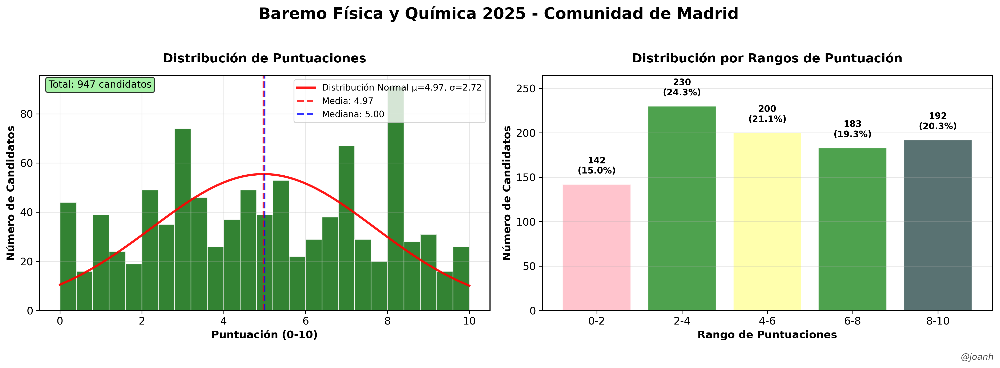

# Física y Química (007) - Baremo 2025 🧪

Extracción y análisis de datos para la especialidad de **Física y Química** (código 007) del baremo provisional de oposiciones 2025 de la Comunidad de Madrid.

## 📊 Información de la Especialidad

- **Código**: 007
- **Nombre**: Física y Química  
- **Nivel**: Profesores de Enseñanza Secundaria
- **Total candidatos**: 947
- **Páginas**: 925-1062 (138 páginas)
- **Fuente**: [Baremo Provisional CM](https://www.comunidad.madrid/sites/default/files/doc/educacion/rh03/rh03_257_2025_590_12_baremo_prov.pdf)

## 📈 Resultados de la Extracción

- **Total candidatos**: 947
- **Puntuación máxima**: 10.0000
- **Puntuación mínima**: 0.0000  
- **Puntuación media**: 4.9700
- **Mediana**: 5.0000
- **Desviación estándar**: 2.7245

### Validación exitosa

✅ **Página 1062** (última): 6/6 puntuaciones validadas correctamente  
⚠️ **Página 925** (primera): 6/7 puntuaciones validadas (una puntuación en formato diferente)



## 🚀 Uso

### 1. Copiar PDF

```bash
# Desde el directorio del proyecto principal
copy data\rh03_257_2025_590_12_baremo_prov.pdf especialidades\fisica_quimica_007\data\baremo_fisica_quimica_007_2025.pdf
```

### 2. Extraer datos

```bash
cd scripts
python extractor_fisica_quimica.py
```

### 3. Generar visualización

```bash
python visualizador_fisica_quimica.py
```

## 🔍 Validación

El extractor incluye validación automática contra las puntuaciones de referencia:

### Página 925 (primera página):
- 4.8333, 3.0667, 7.3500, 4.2500, 4.6667, 3.5417, 7.0000

### Página 1062 (última página):
- 4.0834, 8.4084, 3.0000, 8.0000, 5.5000, 5.4584

## 📁 Estructura

```
fisica_quimica_007/
├── scripts/
│   ├── extractor_fisica_quimica.py      # Extractor específico
│   └── visualizador_fisica_quimica.py   # Gráficos profesionales
├── data/
│   └── baremo_fisica_quimica_007_2025.pdf  # PDF específico
├── output/                               # Resultados generados
├── config.yaml                          # Configuración de la especialidad
└── README.md                            # Este archivo
```

## ⚙️ Configuración

El archivo `config.yaml` contiene:
- Páginas del PDF a procesar (925-1062)
- Patrones de extracción específicos
- Configuración de visualización
- Metadatos de la especialidad
- Puntuaciones de validación

## 🎯 Archivos Generados

- `puntuaciones_fisica_quimica_007.csv` - Datos en formato CSV
- `puntuaciones_fisica_quimica_007.txt` - Lista legible
- `lista_fisica_quimica_007.py` - Array de Python
- `estadisticas_fisica_quimica_007.txt` - Estadísticas básicas
- `baremo_fisica_quimica_007_2025.png/pdf` - Gráficos profesionales

## 📈 Ejemplo de Resultados

Una vez ejecutado correctamente, se generarán:
- Histograma de distribución de puntuaciones con curva normal
- Gráfico de barras por rangos con porcentajes
- Estadísticas descriptivas completas
- Validación automática de datos extraídos

## 🔧 Requisitos

```bash
pip install pdfplumber pandas matplotlib numpy scipy pyyaml
```

## ✍️ Autor

**@joanh** - Análisis y visualización de datos de oposiciones  
Asistente: Claude Sonnet 4.0
