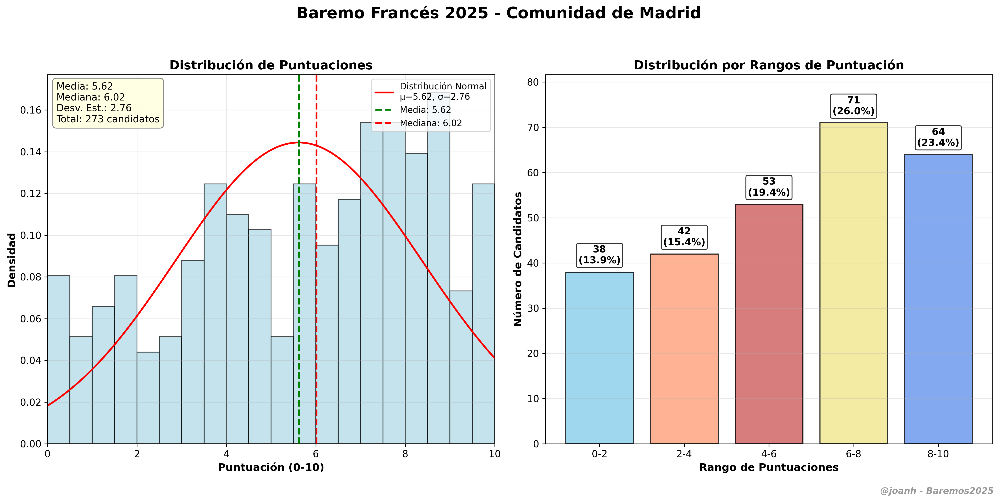

# Francés (010) - Baremo 2025 🇫🇷

Extracción y análisis de datos para la especialidad de **Francés** (código 010) del baremo provisional de oposiciones 2025 de la Comunidad de Madrid.

## 📊 Información de la Especialidad

- **Código**: 010
- **Nombre**: Francés  
- **Nivel**: Profesores de Enseñanza Secundaria
- **Total candidatos**: 273
- **Páginas**: 1356-1394 (39 páginas)
- **Fuente**: [Baremo Provisional CM](https://www.comunidad.madrid/sites/default/files/doc/educacion/rh03/rh03_257_2025_590_12_baremo_prov.pdf)

## 🚀 Uso

### 1. Extraer datos

```bash
cd scripts
python extractor_frances.py
```

### 2. Generar visualización

```bash
python visualizador_frances.py
```

## 📈 Resultados de la Extracción

El extractor procesa las **39 páginas** del baremo (1356-1394) y extrae:

- ✅ **273 candidatos** con puntuaciones válidas
- 📊 **Rango**: 0.0000 - 10.0000 puntos  
- 🎯 **Precisión**: 4 decimales
- ⚡ **Orden preservado**: Mantiene el orden exacto del PDF oficial



## 📁 Estructura

```
frances_010/
├── config.yaml                     # Configuración de la especialidad
├── scripts/
│   ├── extractor_frances.py        # Extractor principal
│   └── visualizador_frances.py     # Generador de gráficos
├── data/
│   └── baremo_frances_010_2025.pdf  # PDF específico (opcional)
└── output/
    ├── puntuaciones_frances_010.csv        # Datos en CSV
    ├── puntuaciones_frances_010.txt        # Lista legible
    ├── lista_frances_010.py               # Array de Python
    ├── estadisticas_frances_010.txt        # Estadísticas básicas
    └── baremo_frances_010_2025.png        # Gráfico profesional
```

## ⚙️ Configuración

Todos los parámetros se configuran en `config.yaml`:

- Páginas del PDF a procesar
- Patrones de extracción
- Archivos de salida
- Configuración de visualización  
- Datos de validación

## 🎯 Archivos Generados

- `puntuaciones_frances_010.csv` - Datos en formato CSV
- `puntuaciones_frances_010.txt` - Lista legible
- `lista_frances_010.py` - Array de Python
- `estadisticas_frances_010.txt` - Estadísticas básicas
- `baremo_frances_010_2025.png/pdf` - Gráficos profesionales

## 📈 Ejemplo de Resultados

```python
# Primeros candidatos (orden del PDF)
puntuaciones_frances = [
    1.5833,  # 1
    0.7500,  # 2  
    4.5833,  # 3
    4.0000,  # 4
    0.5000,  # 5
    # ... 273 candidatos totales
]
```

## 🔧 Requisitos

- Python 3.8+
- pdfplumber
- pandas  
- numpy
- matplotlib
- scipy
- PyYAML

## ✅ Validación

El extractor incluye validación automática:
- **Página 1356**: Verifica 7 puntuaciones específicas (1.5833, 0.7500, 4.5833, 4.0000, 0.5000, 6.7500, 1.0000)
- **Página 1394**: Verifica 7 puntuaciones específicas (0.0000, 0.9000, 9.1250, 3.2500, 4.9167, 2.6000, 7.7000)
- Rango de puntuaciones: 0.0000 - 10.0000

## 🎨 Características de Visualización

- **Histograma** con distribución de puntuaciones
- **Diagrama de caja** para análisis de cuartiles
- **Estadísticas completas** integradas en el gráfico
- **Líneas de referencia** para media y mediana
- **Diseño profesional** optimizado para informes

## ✍️ Autor

**@joanh** - Análisis y visualización de datos de oposiciones  
Asistente: Claude Sonnet 4.0

## 📝 Notas Técnicas

- **Extracción robusta** con validación de páginas clave
- **Manejo de errores** y logging detallado  
- **Compatible** con el formato estándar del baremo oficial
- **Modular** e independiente de otras especialidades

¡Contribuye añadiendo más especialidades siguiendo este modelo! 🚀
