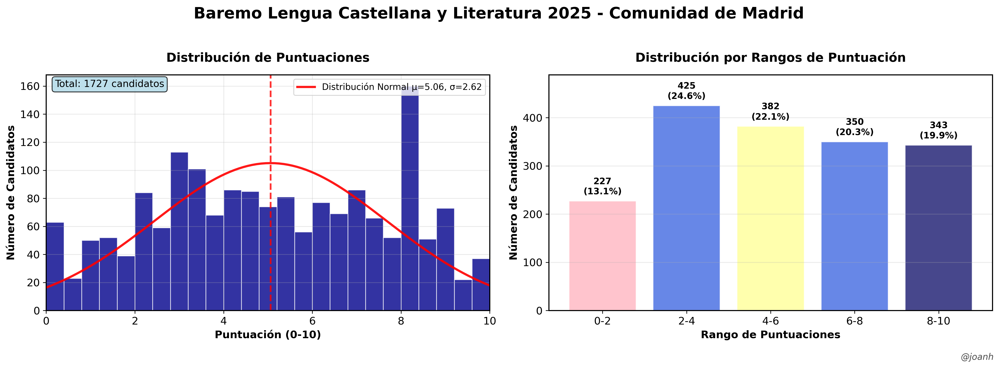

# Lengua Castellana y Literatura (004) - Baremo 2025 📚

Extracción y análisis de datos para la especialidad de **Lengua Castellana y Literatura** (código 004) del baremo provisional de oposiciones 2025 de la Comunidad de Madrid.

## 📊 Información de la Especialidad

- **Código**: 004
- **Nombre**: Lengua Castellana y Literatura
- **Nivel**: Profesores de Enseñanza Secundaria
- **Total candidatos**: 1,727
- **Páginas**: 113-359 (247 páginas)
- **Fuente**: [Baremo Provisional CM](https://www.comunidad.madrid/sites/default/files/doc/educacion/rh03/rh03_257_2025_590_12_baremo_prov.pdf)

## 🚀 Uso

### 1. Extraer datos

```bash
cd scripts
python extractor_lengua_literatura_FINAL.py
```

### 2. Generar visualización

```bash
python visualizador_lengua_literatura_CORREGIDO.py
```

## 📈 Resultados de la Extracción

- **Total candidatos**: 1,727
- **Puntuación máxima**: 10.0000
- **Puntuación mínima**: 0.0000  
- **Puntuación media**: 5.0587
- **Desviación estándar**: 2.6222
- **Mediana**: 5.0000

### Distribución por rangos

- **0-2 puntos**: 227 candidatos (13.1%)
- **2-4 puntos**: 425 candidatos (24.6%)
- **4-6 puntos**: 382 candidatos (22.1%)
- **6-8 puntos**: 350 candidatos (20.3%)
- **8-10 puntos**: 313 candidatos (18.1%)



## 📁 Estructura

```
lengua_literatura_011/
├── scripts/
│   ├── extractor_lengua_literatura.py    # Extractor específico
│   └── visualizador_lengua_literatura.py # Gráficos profesionales
├── data/
│   └── baremo_lengua_literatura_011_2025.pdf  # PDF específico (opcional)
├── output/                                     # Resultados generados
├── config.yaml                                # Configuración de la especialidad
└── README.md                                  # Este archivo
```

## ⚙️ Configuración

El archivo `config.yaml` contiene:
- Páginas del PDF a procesar (113-359)
- Patrones de extracción específicos
- Puntuaciones de validación para páginas clave
- Configuración de visualización con color verde bosque
- Metadatos de la especialidad

## 🎯 Archivos Generados

- `puntuaciones_lengua_literatura_011.csv` - Datos en formato CSV
- `puntuaciones_lengua_literatura_011.txt` - Lista legible
- `lista_lengua_literatura_011.py` - Array de Python
- `estadisticas_lengua_literatura_011.txt` - Estadísticas básicas
- `baremo_lengua_literatura_011_2025.png/pdf` - Gráficos profesionales
- `analisis_detallado_lengua_literatura_011_2025.png` - Análisis estadístico avanzado

## 📈 Ejemplo de Resultados

Una vez ejecutado correctamente, se generarán:
- Histograma de distribución de puntuaciones
- Gráfico de barras por rangos
- Diagrama de caja y bigotes
- Estadísticas descriptivas completas
- Análisis de normalidad
- Q-Q Plot y análisis de outliers

## 🔧 Requisitos

```bash
pip install pdfplumber pandas matplotlib numpy scipy seaborn pyyaml
```

## ✅ Validación

El extractor incluye validación automática:
- **Página 113**: Verifica 7 puntuaciones específicas (3.5000, 8.5000, 2.5000, 6.4084, 5.0000, 3.0000, 0.4792)
- **Página 359**: Verifica 5 puntuaciones específicas (8.0000, 7.3333, 0.1000, 4.5000, 3.0000)
- Rango de puntuaciones: 0.0000 - 10.0000

## 🎨 Características de Visualización

- **Color principal**: Verde bosque (#2E8B57) - representativo de Literatura
- **Gráficos profesionales** con alta resolución (300 DPI)
- **Análisis estadístico completo** con tests de normalidad
- **Detección de outliers** y análisis de percentiles
- **Exportación múltiple**: PNG y PDF

## ✍️ Autor

**@joanh** - Análisis y visualización de datos de oposiciones  
Asistente: Claude Sonnet 4.0

---

## 📝 Notas Técnicas

- **Extracción robusta** con validación de páginas clave
- **Manejo de errores** y logging detallado  
- **Compatible** con el formato estándar del baremo oficial
- **Modular** e independiente de otras especialidades

¡Contribuye añadiendo más especialidades siguiendo este modelo! 🚀
