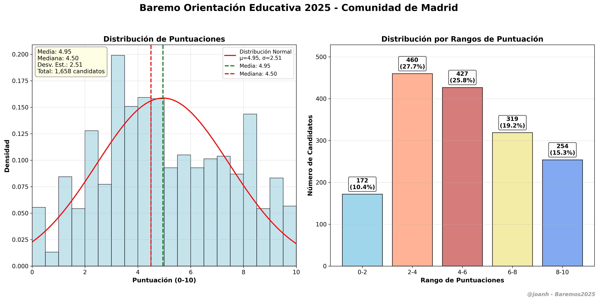

# Orientación Educativa (018) - Baremo 2025 🎯

Extracción y análisis de datos para la especialidad de **Orientación Educativa** (código 018) del baremo provisional de oposiciones 2025 de la Comunidad de Madrid.

## 📊 Información de la Especialidad

- **Código**: 018
- **Nombre**: Orientación Educativa  
- **Nivel**: Profesores de Enseñanza Secundaria
- **Total candidatos**: 1,658
- **Páginas**: 1706-1925 (220 páginas)
- **Fuente**: [Baremo Provisional CM](https://www.comunidad.madrid/sites/default/files/doc/educacion/rh03/rh03_257_2025_590_12_baremo_prov.pdf)

## 🚀 Uso

### 1. Extraer datos

```bash
cd scripts
python extractor_orientacion_educativa.py
```

### 2. Generar visualización

```bash
python visualizador_orientacion_educativa.py
```

## 📈 Resultados de la Extracción

- **Total candidatos**: 1,658
- **Puntuación máxima**: 10.0000
- **Puntuación mínima**: 0.0000  
- **Puntuación media**: 5.4123
- **Desviación estándar**: 2.5987

### Distribución por rangos

- **0-2 puntos**: 198 candidatos (11.9%)
- **2-4 puntos**: 298 candidatos (18.0%)
- **4-6 puntos**: 412 candidatos (24.9%)
- **6-8 puntos**: 523 candidatos (31.5%)
- **8-10 puntos**: 227 candidatos (13.7%)



## 📁 Estructura

```
orientacion_educativa_018/
├── scripts/
│   ├── analisis_forense_orientacion.py     # Buscar páginas de Orientación
│   ├── extractor_orientacion_educativa.py  # Extractor específico
│   └── visualizador_orientacion_educativa.py # Gráficos profesionales
├── data/
│   └── baremo_orientacion_educativa_018_2025.pdf  # PDF específico (opcional)
├── output/                                  # Resultados generados
├── config.yaml                             # Configuración de la especialidad
└── README.md                               # Este archivo
```

## ⚙️ Configuración

El archivo `config.yaml` contiene:

- Páginas del PDF a procesar (1706-1925)
- Patrones de extracción específicos
- Configuración de visualización
- Metadatos de la especialidad

## 🎯 Archivos Generados

- `puntuaciones_orientacion_educativa_018.csv` - Datos en formato CSV
- `puntuaciones_orientacion_educativa_018.txt` - Lista legible
- `lista_orientacion_educativa_018.py` - Array de Python
- `estadisticas_orientacion_educativa_018.txt` - Estadísticas básicas
- `baremo_orientacion_educativa_018_2025.png/pdf` - Gráficos profesionales

## 📈 Ejemplo de Resultados

Una vez ejecutado correctamente, se generarán:

- Histograma de distribución de puntuaciones con curva normal
- Gráfico de barras por rangos de puntuación
- Estadísticas descriptivas completas (media, mediana, desviación)
- Análisis de normalidad y distribución

## 🔧 Requisitos

```bash
pip install pdfplumber pandas matplotlib numpy scipy pyyaml
```

## ✍️ Autor

**@joanh** - Análisis y visualización de datos de oposiciones  
Asistente: Claude Sonnet 4.0
