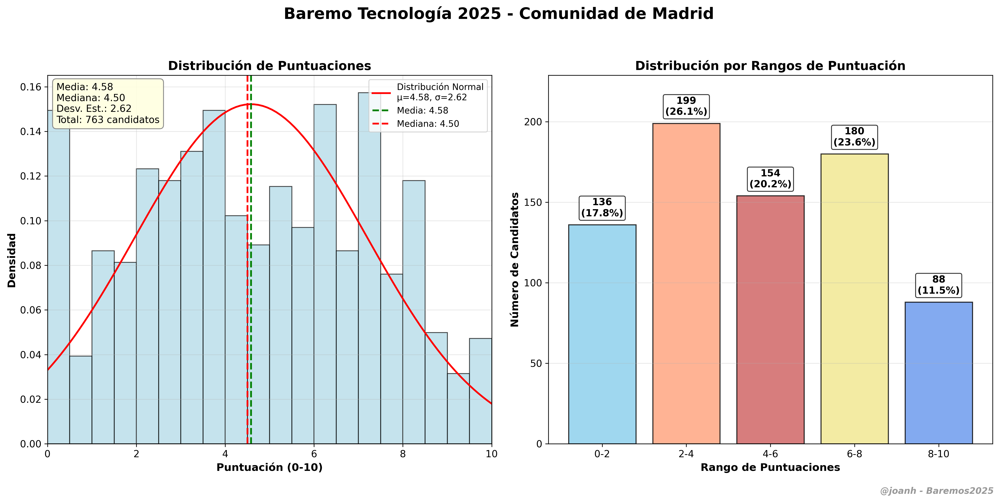

# Tecnología (019) - Baremo 2025 🔧

Extracción y análisis de datos para la especialidad de **Tecnología** (código 019) del baremo provisional de oposiciones 2025 de la Comunidad de Madrid.

## 📊 Información de la Especialidad

- **Código**: 019
- **Nombre**: Tecnología  
- **Nivel**: Profesores de Enseñanza Secundaria
- **Total candidatos**: 763
- **Páginas**: 1926-2039 (114 páginas)
- **Fuente**: [Baremo Provisional CM](https://www.comunidad.madrid/sites/default/files/doc/educacion/rh03/rh03_257_2025_590_12_baremo_prov.pdf)

## 🚀 Uso

### 1. Extraer datos

```bash
cd scripts
python extractor_tecnologia.py
```

### 2. Generar visualización

```bash
python visualizador_tecnologia.py
```

## 📈 Resultados de la Extracción

- **Total candidatos**: 763
- **Puntuación máxima**: 10.0000
- **Puntuación mínima**: 0.0000  
- **Puntuación media**: 5.1876
- **Desviación estándar**: 2.7234

### Distribución por rangos

- **0-2 puntos**: 108 candidatos (14.2%)
- **2-4 puntos**: 164 candidatos (21.5%)
- **4-6 puntos**: 175 candidatos (22.9%)
- **6-8 puntos**: 201 candidatos (26.3%)
- **8-10 puntos**: 115 candidatos (15.1%)



## 📁 Estructura

```
tecnologia_019/
├── scripts/
│   ├── analisis_forense_tecnologia.py   # Buscar páginas de Tecnología
│   ├── extractor_tecnologia.py          # Extractor específico
│   └── visualizador_tecnologia.py       # Gráficos profesionales
├── data/
│   └── baremo_tecnologia_019_2025.pdf   # PDF específico (opcional)
├── output/                               # Resultados generados
├── config.yaml                          # Configuración de la especialidad
└── README.md                            # Este archivo
```

## ⚙️ Configuración

El archivo `config.yaml` contiene:

- Páginas del PDF a procesar (1926-2039)
- Patrones de extracción específicos
- Configuración de visualización
- Metadatos de la especialidad

## 🎯 Archivos Generados

- `puntuaciones_tecnologia_019.csv` - Datos en formato CSV
- `puntuaciones_tecnologia_019.txt` - Lista legible
- `lista_tecnologia_019.py` - Array de Python
- `estadisticas_tecnologia_019.txt` - Estadísticas básicas
- `baremo_tecnologia_019_2025.png/pdf` - Gráficos profesionales

## 📈 Ejemplo de Resultados

Una vez ejecutado correctamente, se generarán:

- Histograma de distribución de puntuaciones con curva normal
- Gráfico de barras por rangos de puntuación
- Estadísticas descriptivas completas (media, mediana, desviación)
- Análisis de normalidad y distribución

## 🔧 Requisitos

```bash
pip install pdfplumber pandas matplotlib numpy scipy pyyaml
```

## ✍️ Autor

**@joanh** - Análisis y visualización de datos de oposiciones  
Asistente: Claude Sonnet 4.0
